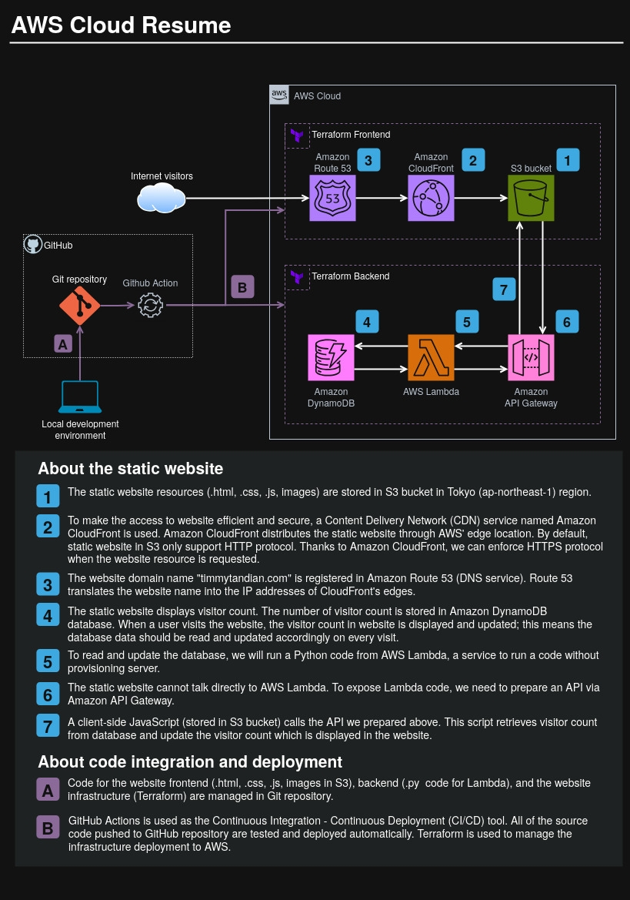

# myresume_backend
This repository contains codes for the backend part of the Cloud Resume Challenge, a static website hosted in cloud that showcases my resume. This repository provides the infrastructure and logic to track website visitor counts.

## Architecture Diagram



## Code Contents

### 1. Infrastructure Code
The Infrastructure as Code is implemented with Terraform.
1. **AWS API Gateway Module**: Terraform code to create an API Gateway for interfacing the frontend with the Lambda function.
2. **AWS DynamoDB Module**: Terraform code to provision a DynamoDB table to store the visitor count.
3. **AWS Lambda Function Module**: Terraform code to deploy a Lambda function that updates the visitor count in the DynamoDB table.

### 2. Lambda Function Implementation
1. **Python Code**: The logic to manipulate the visitor count in DynamoDB.
2. **Python Unit Tests**: Test cases to verify the correctness of the Lambda function implementation.

### 3. CI/CD Implementation
1. **GitHub Actions Workflow**: A workflow file (.yml) to automate the code test and deployment (resource provisioning with Terraform).

## Directory Structure Overview
```
myresume_backend/
├── .github/
│   └── workflows/
│       └── build_deploy.yml         (Code Content 3-1)
├── myresume_backend/
│   ├── __init__.py
│   └── lambda_functions.py          (Code Content 2-1)
├── terraform/
│   ├── environments/
│   │   ├── dev/
│   │   │   ├── main.tf
│   │   │   └── ...
│   │   └── prod/
│   │       └── main.tf
│   │       └── ...
│   └── modules/
│       ├── api_gateway/             (Code Content 1-1)
│       │   └── ...
│       ├── dynamodb/                (Code Content 1-2)
│       │   └── ...
│       └── lambda/                  (Code Content 1-3)
│           └── ...
├── tests/
│   ├── events/
│   └── unit/
│       └── test_lambda_function.py  (Code Content 3-1)
│
└── ...(other repo files)

```

## How to Use

### Prerequisites
- Terraform installed on your local machine.
- AWS CLI configured with proper credentials and permissions.
- Python 3.x installed with `boto3` and `pytest` packages.
- GitHub repository configured with proper permissions.

### Deployment Steps
1. Navigate to the `[prod|dev]` directory under the Terraform environment directory. If you are using the `prod` branch go to the `prod` directory, otherwise use the `dev` branch.
2. Initialize Terraform: `terraform init`
3. Plan the deployment: `terraform plan`
4. Apply the deployment: `terraform apply`
5. Configure GitHub Actions:
   - Ensure the workflow file (`.github/workflows/build_deploy.yml`) is correctly set up.
   - Push changes to the `dev` or `prod` branch to trigger the CI/CD pipeline.